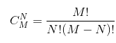

### 函数与模块
***
计算排列组合C(M,N)



```py
'''
File    :   排列组合..py
Time    :   2023/02/23 20:52:11
Author  :   Z-JUNYE 
Version :   1.0
Comment :   计算C(M,N)
'''

M = int(input('input number M : '))
N = int(input('input number N : '))

fM = 1
for i in range(1, M+1):
    fM *= i

fN = 1
for i in range(1, N+1):
    fN *= i

fM_N = 1
for i in range(1, M-N+1):
    fM_N *= i

print(fM / fN / fM_N)
```

#### 函数的作用
上面的代码中，做了三个求阶乘，这样的代码是重复代码。要写出高质量的代码首先要解决就是重复代码的问题。对于上面的代码来说，我们可以将计算阶乘的功能封装到一个函数的功能模块中，在需要计算阶乘的地方，调用这个函数即可。
***
#### 定义函数
python中用`def`关键词定义函数，在函数名后的圆括号中可以防止传递给函数的参数，这点与数学上的函数非常类似，程序中函数的参数就相当于是数学上说的函数的自变量，而函数执行完成后我们可以通过`return`关键字来返回一个值，这相当于数学上说的函数的因变量。

利用函数重构上面的代码：
```py
'''
File    :   排列组合函数.py
Time    :   2023/02/23 21:03:59
Author  :   Z-JUNYE 
Version :   1.0
Comment :  用函数来计算C(M,N) 
'''

def fac(num):
    '''求阶乘'''
    result = 1
    for i in range(1,num+1):
        result *= i
    return result

M = int(input('input number M : '))
N = int(input('input number N : '))

print(fac(M) / fac(N) / fac(M-N)
```

在多数情况下，不需要自己构建函数，使用python模块中自带的函数更为高效。
***
#### 函数的参数
函数是大多数变成语言中都支持的一个代码的block，但是python中的函数与其他语言中的函数还是有一些不同，其中一个显著区别就是python对函数参数的处理。在Python中，函数的参数可以有默认值，也支持使用可变参数。
```py
'''
File    :   函数参数example.py
Time    :   2023/02/23 21:15:49
Author  :   Z-JUNYE 
Version :   1.0
Comment :   函数参数的默认值
'''

from random import randint

def rollDice(n=2):
    '''摇色子'''
    sumDice = 0
    for i in range(n):
        sumDice += randint(1,6)
    return sumDice

def add(a=0, b=0, c=0):
    '''三个数相加'''
    return a+b+c

print(rollDice())
print(rollDice(3))
print(add())
print(add(1))
print(add(1,2))
print(add(1,2,3))
```
结果如下：
```py
print(rollDice())
print(rollDice(3))
print(add())
print(add(1))
print(add(1,2))
print(add(1,2,3))

10
8
0
1
3
6
```

上面两个函数都设置了默认值，在调用函数时如果没有传入对应参数，将使用该参数的默认值。
上面的`add`函数有更好的实现方案，上面只针对3个以内的参数，当不知道有多少参数时，可以使用可变参数：
```py
'''
File    :   可变参数example.py
Time    :   2023/02/23 21:21:51
Author  :   Z-JUNYE 
Version :   1.0
Comment :   可变参数example
'''

def add(*args):
    result = 0
    for i in args:
        result += i
    return result

print(add(1,2,3,4,5,6))
```
***
#### 用模块管理函数
针对函数命名冲突，由于python没有函数重载的概念，后面定义的函数会覆盖之前的定义，也就意味着两个同名函数实际只有一个是存在的。
Python中每个文件就代表了一个模块`module`，我们在不同的模块中可以有同名的函数，在使用函数时通过`import`关键字导入指定的模块就可以区分到底要使用的哪个模块中的函数。
代码如下：
```py
module1.py
```
```py
'''
File    :   module1.py
Time    :   2023/02/23 21:26:09
Author  :   Z-JUNYE 
Version :   1.0
Comment :   模块1中的foo函数
'''

def foo():
    print('hello world')
```
```py
module2.py
```
```py
'''
File    :   module1.py
Time    :   2023/02/23 21:26:09
Author  :   Z-JUNYE 
Version :   1.0
Comment :   模块2中的foo函数
'''

def foo():
    print('byebye world')
```

下面分别调用两个模块的foo函数：
```py
'''
File    :   调用同名函数.py
Time    :   2023/02/23 21:31:30
Author  :   Z-JUNYE 
Version :   1.0
Comment :   调用同名函数
'''
import module1
import module2

module1.foo()
module2.foo()
```
```py
hello world
byebye world
```

如果导入的模块除了定义函数之外还有可以执行的代码，那么python解释器在导入这个模块时就会执行这些代码，但我们可能并不希望如此，因此如果我们在模块中编写了执行代码，最好是将这些代码放入如下所示的条件中，这样的话，除非直接运行该模块，`if`条件下的这些代码是不会执行的，因为只有直接执行的模块的名字才是`__main__`。
```py
def foo():
    pass

#__name__ 是python中一个隐含的变量，它代表了模块的名字
#只有被python解释器直接执行的模块的名字才是__main__
if __name__ == '__main__':
    print('call foo()')
    foo()
```
当我们将代码中重复出现的和相对独立的功能抽取成函数后，可以组成使用这些函数来解决更为复杂的问题。
***
#### 变量的作用域

```py
'''
File    :   变量作用域example.py
Time    :   2023/02/23 22:20:10
Author  :   Z-JUNYE 
Version :   1.0
Comment :   变量作用域example
'''

def foo():
    b = 'hello'

    # 函数内部嵌套函数
    def bar():
        c = True
        print(a)
        print(b)
        print(c)
    
    bar()

if __name__ == '__main__':
    a = 100
    foo()
```
以上代码运行结果:
```py
100
hello
True
```

上面的代码能够顺利运行并且打印，但是在`bar`函数内部没有定义`a`和`b`两个变量。上面代码的`if`分支中定义了变量`a`，这是一个全局变量`global variable`，属于全局作用域，因为它没有定义在任何一个函数中。
在上面的`foo`函数中定义了变量`b`，这是一个定义在函数中的局部变量`local variable`，属于局域作用域。在`foo`外部并不能访问它，但是对于`foo`函数内部的`bar`函数来说，变量`b`属于嵌套作用域，在`bar`函数中可以访问。
Python查找一个变量时会按照“局部作用域”、“嵌套作用域”、“全局作用域”和“内置作用域”的顺序进行搜索。
所谓的“内置作用域”就是python内置的标识符，之前使用的`init` `print` `input`等都属于内置作用域。

通过函数不能直接修改全局变量：

```py
'''
File    :   修改全局变量.py
Time    :   2023/02/23 22:28:01
Author  :   Z-JUNYE 
Version :   1.0
Comment :   修改全局变量
'''

def foo():
    a = 200
    print(a)

if __name__ == '__main__':
    a = 100
    foo()
    print(a)
```
运行结果如下：
```py
200
100
```
在调用`foo`函数后，`a`的值依旧是100，因为在函数`foo`中是重新定义了一个名字为`a`的局部变量，它与全局作用域的`a`并不是同一个变量。当希望函数可以修改全局变量时，需要使用`global`关键字来将其置于全局作用域。
```py
'''
File    :   修改全局变量.py
Time    :   2023/02/23 22:28:01
Author  :   Z-JUNYE 
Version :   1.0
Comment :   修改全局变量
'''

def foo():
    global a
    a = 200
    print(a)

if __name__ == '__main__':
    a = 100
    foo()
    print(a)
```

运行结果如下：
```py
200
200
```

同理，如果我们希望函数内部的函数能够修改嵌套作用域中的变量，可以使用`nonlocal`关键字来指示变量来自于嵌套作用域。

在实际开发中，应该尽量减少对全部变量的使用，因为全局变量作用域和影响过于广泛，可能会发生意料之外的修改和使用，除此之外全局变量比局部变量拥有更长的生命周期，可能导致对象占用的内存长时间无法被垃圾回收。事实上，减少对全局变量的使用，也是降低代码直接耦合度的一个重要举措。
减少全部变量的使用就意味着我们应该尽量让变量的作用域在函数的内部，但是如果我们希望将一个局部变量的生命周期延长，使其在定义它的函数调用结束后依然可以使用它的值，就需要使用闭包。

结果就是将python代码按照下面的格式进行书写：
```py
def main():
    # add code
    pass

if __name__ == '__main__':
    main()