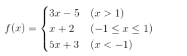

## 分支结构
***
#### 应用场景
顺序结构与分支结构。根据是否满足特定条件进入不同分支的结构。

### if语句
在python中，要构造分支结构可以使用`if`、`elif`、`else`关键字。
python中使用**缩进的方式**表示代码的层次结构。如果`if`条件下需要执行多条语句，只需要保持多条语句具有相同的缩进即可。

    '''
    File    :   用户身份验证.py
    Time    :   2023/02/20 21:31:13
    Author  :   Z-JUNYE 
    Version :   1.0
    '''

    username = input('input username: ')
    passWD = input('input password: ')
    if username == 'admin' and passWD == '123456':
        print('验证成功')
    else:
        print('验证失败')

多个分支结构  

    '''
    File    :   分段函数.py
    Time    :   2023/02/20 21:55:25
    Author  :   Z-JUNYE 
    Version :   1.0
    '''

    x = float(input('input value of x : '))
    if x > 1:
        y = x * 3 - 5
    elif x < -1:
        y = x * 5 +3
    else:
        y = x + 2
    print('f(%.2f) = %.2f' % (x, y))

根据实际开发需求，分支结构是可以嵌套的。需要在`if`的内部构造出一个新的分支结构，同理`elif`和`else`中也可以构造新的分支，成为嵌套的分支结构。  

    '''
    File    :   分段函数2.py
    Time    :   2023/02/20 22:05:24
    Author  :   Z-JUNYE 
    Version :   1.0
    '''

    x = float(input('input value of x: '))
    if x > 1:
        y = x * 3 - 5
    else:
        if x < -1:
            y = 5 * x + 3
        else:
            y = x + 2
    print('f(%.2f) = %.2f' % (x, y))