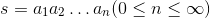
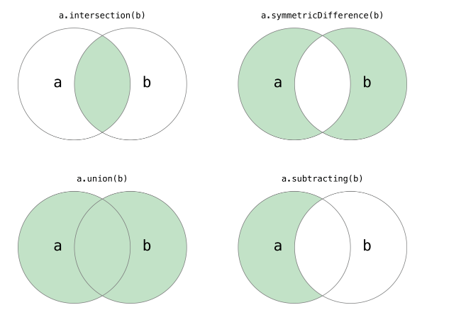

### 字符串和常用数据结构
***
#### 使用字符串
所谓**字符串**，就是由零个或多个字符组成的有限序列，一般记为 。在python中，如果我们把单个或多个字符串用单引号或者双引号包围起来，就可以表示一个字符串。
```py
'''
File    :   字符串example.py
Time    :   2023/02/24 21:18:53
Author  :   Z-JUNYE 
Version :   1.0
Comment :   字符串
'''
s1 = 'helo, world!'
s2 = "hello, world!"
s3 = '''
hello,
world!
'''
print(s1, s2, s3, end = '')
```
```py
helo, world! hello, world! 
hello,
world!
```
在字符串中使用`\`反斜杠来表示转义，也就是说`\`后面的字符不再是它原来的意义，例如`\n`不是代表反斜杠和字母n，而是表示换行；而`\t`也不是代表反斜杠和字符t，而是表示制表符。所以如果想在字符串中表示`'`要写成`\'`，而同理想表示`\`要写成`\\`。
```py
'''
File    :   转义符example.py
Time    :   2023/02/24 21:30:10
Author  :   Z-JUNYE 
Version :   1.0
Comment :   转义符example
'''

s1 = '\'hello, world!\''
s2 = '\n\\hello, world!\\\n'
print(s1, s2, end = '')
```
```py
'hello, world!' 
\hello, world!\
```

在`\`后面还可以跟一个八进制或者十六进制数来表示字母，例如`\141`和`\x61`都代表小写字母`a`，前者是八进制的表示法，后者是十六进制的表示法。也可以在`\`后面跟unicode字符编码来表示字符。
```py
'''
File    :   转义符example2.py
Time    :   2023/02/24 21:34:12
Author  :   Z-JUNYE 
Version :   1.0
Comment :   转义符example
'''

s1 = '\141\142\142\x61\x62\x63'
s2 = '\u8c22\u8c22'
print(s1, s2, end = '')
```
```py
abbabc 谢谢
```
如果不希望字符串中的`\`表示转义，我们可以通过在字符串的最前面加上字母`r`来加以说明。
```py
'''
File    :   字符串转义example3.py
Time    :   2023/02/24 21:40:08
Author  :   Z-JUNYE 
Version :   1.0
Comment :   转义符example3
'''

s1 = r'\'hello, world!\''
s2 = r'\n\\hello, world!\\\n'
print(s1, s2, end = '')
```
```py
\'hello, world!\' \n\\hello, world!\\\n
```
python为字符串类型提供了丰富的运算符，我们可以使用`+`运算符来实现字符串的拼接，可以使用`*`运算符来重复一个字符串的内容，可以使用`in`和`not in`来判断一个字符串是否包含另外一个字符串（成员运算），我们也可以用`[]`和`[:]`运算符从字符串中取出某个字符或某些字符（切片运算）。
```py
'''
File    :   字符串运算符.py
Time    :   2023/02/24 22:14:09
Author  :   Z-JUNYE 
Version :   1.0
Comment :   字符串运算符
'''
s1 = 'hello' * 3
print(s1)
s2 = 'world'
s1 += s2
print(s1)
print('ll' in s1)
print('good' in s1)

str2 = 'abc123456'
print(str2[2])
print(str2[2:5])
print(str2[2:])
print(str2[2::2])
print(str2[::2])
print(str2[::-1])
print(str2[-3:-1])
```
```py
hellohellohello
hellohellohelloworld
True
False
c
c12
c123456
c246
ac246
654321cba
45
```
在Python中，我们还可以通过一系列的方法来完成对字符串的处理。
```py
'''
File    :   字符串处理.py
Time    :   2023/02/25 12:41:33
Author  :   Z-JUNYE 
Version :   1.0
Comment :   字符串处理
'''

str1 = 'hello, world!'
#计算字符串长度
print(len(str1)) # 13
#获得字符串首字母大写的copy
print(str1.capitalize()) #Hello, world!
#获得字符串每个单词首字母大写的copy
print(str1.title()) #Hello, World!
#获得字符串大写的copy
print(str1.upper()) #HELLO, WORLD!
#从字符串中查找子串的为止
print(str1.find('or')) # 8
print(str1.find('shit')) # -1
#index也可以用来查找，但会引发异常一旦找不到子串
#print(str1.index('or'))
#print(str1.index('shit'))
#检查字符串是否以指定子串开头
print(str1.startswith('he')) # False
print(str1.startswith('hel')) # True
#检查字符串是否以指定的子串结尾
print(str1.endswith('!')) # True
#将字符串以指定的宽度居中并在两侧填充指定的字符
print(str1.center(50, '*')) 
# ******************hello, world!*******************
#将字符串以指定的宽度靠右放置并在左侧填充指定的字符
print(str1.rjust(50,'*'))
# *************************************hello, world!
#检查字符串是否由数字构成
str2 = '123abc'
print(str2.isdigit()) # False
#检查字符串是否由字母构成
print(str2.isalpha()) # False
#检查字符串是否由数字和字母组成
print(str2.isalnum()) # True
str3 = '    scarzjy@gmail.com  '
print(str3) #     scarzjy@gmail.com
# 获得字符串修剪左右空格之后的copy
print(str3.strip()) # scarzjy@gmail.com
```
格式化输出字符串
```py
'''
File    :   格式化输出字符串.py
Time    :   2023/02/25 13:07:47
Author  :   Z-JUNYE 
Version :   1.0
Comment :   格式化输出字符串
'''

a, b = 5, 10
print('%d * %d = %d' % (a, b, a * b))
print('{0} * {1} = {2}'.format(a, b, a * b))
print(f'{a} * {b} = {a * b}')
```
***
#### 使用列表
数值类型`int` `float`是标量类型，这种类型的对象没有可以访问的内部结构；而字符串类型是一种结构化的、非标量类型，所以才会有一系列的属性和方法。
列表`list`也是一种结构化的、非标量类型，它是值的有序序列，每个值都可以通过索引进行标识，定义列表可以将列表的元素放在`[]`中，多个元素用`,`进行分割，可以使用`for`循环对列表元素进行遍历，也可以用`[]`或者`[:]`运算符取出列表中的一个或多个元素。
```py
'''
File    :   列表定义列表遍历列表下标运算.py
Time    :   2023/02/25 14:03:40
Author  :   Z-JUNYE 
Version :   1.0
Comment :   列表
'''
list1 = [1, 3, 5, 7, 100]
print(list1) # [1, 3, 5, 7, 100]

list2 = ["hello"] * 3
print(list2) # ['hello', 'hello', 'hello']
# len函数计算list的元素个数
print(len(list1)) # 5
# 下标\索引运算
print(list1[0]) # 1
print(list1[-1]) # 100

list1[2] = 200
print(list1) # [1, 3, 200, 7, 100]
#通过循环用下标遍历列表元素
for index in range(len(list1)):
    print(list1[index])
'''
1
3
200
7
'''
#通过循环遍历列表
for elem in list1:
    print(elem)

#通过enumerate函数处理列表后再遍历可以同时获得元素索引和值
for index, elem in enumerate(list1):
    print(index, elem)
'''
0 1
1 3
2 200
3 7
4 100
'''
```
向列表中添加元素和从列表中移除元素
```py
'''
File    :   添加元素移除元素.py
Time    :   2023/02/25 14:13:07
Author  :   Z-JUNYE 
Version :   1.0
Comment :   添加元素和移除元素
'''

list1 = [1, 3, 5, 7, 100]
#添加元素
list1.append(200)
list1.insert(1,400)
#合并两个list
list1.extend([1000,2000])
# list1 += [1000,2000]
print(list1) #[1, 400, 3, 5, 7, 100, 200, 1000, 2000]
#判断元素是否存在后删除
if 3 in list1:
    list1.remove(3)
print(list1) #[1, 400, 5, 7, 100, 200, 1000, 2000]
#从指定位置删除
list1.pop(0)
list1.pop(len(list1)-1)
print(list1) #[400, 5, 7, 100, 200, 1000]
#清空list
list1.clear()
print(list1) #[]
```
列表的切片操作
```py
'''
File    :   列表切片.py
Time    :   2023/02/25 14:30:52
Author  :   Z-JUNYE 
Version :   1.0
Comment :   列表的切片
'''

fruits = ['grape', 'apple', 'strawberry', 'waxberry']
fruits += ['pitaya', 'pear', 'mango']
#list切片
fruits2 = fruits[1:4]
print(fruits2) #['apple', 'strawberry', 'waxberry']
#可以通过完整切片来达到复制
fruits3 = fruits[:]
print(fruits3) #['grape', 'apple', 'strawberry', 'waxberry', 'pitaya', 'pear', 'mango']
fruits4 = fruits3[-3:-1]
print(fruits4) #['pitaya', 'pear']
#可以通过反向切片获得倒转后的列表的copy
fruits5 = fruits[::-1]
print(fruits5)
#['mango', 'pear', 'pitaya', 'waxberry', 'strawberry', 'apple', 'grape']
```
列表页可以进行排序
```py
'''
File    :   列表排序.py
Time    :   2023/02/25 14:48:17
Author  :   Z-JUNYE 
Version :   1.0
Comment :   列表排序
'''

list1 = ['orange', 'apple', 'zoo', 'internationalization', 'blueberry']
list2 = sorted(list1)
print(list2) #['apple', 'blueberry', 'internationalization', 'orange', 'zoo']
#sorted函数返回list排序后的copy，并不会对原list产生影响
#函数的设计就应该向sorted一样尽可能不产生副作用
list3 = sorted(list1, reverse = True)
#通过关键字参数指定排序
list4 = sorted(list1, key = len)
print(list3) #['zoo', 'orange', 'internationalization', 'blueberry', 'apple']
print(list4) #['zoo', 'apple', 'orange', 'blueberry', 'internationalization']
#给list对象发出排序消息直接在list中进行排序
list1.sort(reverse=True)
print(list1) #['zoo', 'orange', 'internationalization', 'blueberry', 'apple']
```

#### 生成式和生成器
我们可以用list的生成式语法来创建list。
```py
'''
File    :   生成式和生成器.py
Time    :   2023/02/25 15:02:14
Author  :   Z-JUNYE 
Version :   1.0
Comment :   生成式和生成器
'''
import sys
f = [x for x in range(1,10)]
print(f) #[1, 2, 3, 4, 5, 6, 7, 8, 9]
f = [ x+y for x in 'ABCDE' for y in '1234567']
print(f)
#['A1', 'A2', 'A3', 'A4', 'A5', 'A6', 'A7', 'B1', 'B2', 'B3', 'B4', 'B5', 'B6', 'B7', 'C1', 'C2', 'C3', 'C4', 'C5', 'C6', 'C7', 'D1', 'D2', 'D3', 'D4', 'D5', 'D6', 'D7', 'E1', 'E2', 'E3', 'E4', 'E5', 'E6', 'E7']
#用list的生成表达式语法创建列表容器
#用这种语法创建列表之后元素已经准备就绪所以需要耗费较多的内存空间
f = [x**2 for x in range(1,1000)]
print(sys.getsizeof(f)) #8856

#请注意下面的代码创建的不是一个列表而是一个生成器对象
#通过生成器可以获取到数据到它不占用额外的空间存储数据
#每次需要数据的时候就通过内部的运算得到数据（需要额外花费时间）
f = (x**2 for x in range(1,1000))
print(sys.getsizeof(f)) #112
for val in f:
    print(val)
```

除了上面提到的生成器语法，python中海油另外一种定义生成器的方式，就是通过`yield`关键字将一个普通函数改造成生成器函数。
```py
'''
File    :   斐波那契数列.py
Time    :   2023/02/25 15:14:35
Author  :   Z-JUNYE 
Version :   1.0
Comment :   
'''

def fib(n):
    a,b = 0, 1
    for i in range(n):
        a,b = b, a+b
        yield a

def main():
    for val in fib(20):
        print(val)

if __name__ == '__main__':
    main()
```

####使用元组
元组与列表类似也是一种容器数据类型，可以用一个变量来存储多个数据，不同之处在于元素的元素不能修改。
```py
'''
File    :   元组exa.py
Time    :   2023/02/25 15:17:09
Author  :   Z-JUNYE 
Version :   1.0
Comment :   元组example
'''

t = ('zjy', 38, True, '晴天')
print(t) #('zjy', 38, True, '晴天')
#获取元组中的元素
print(t[0]) #zjy
print(t[3]) #晴天
#遍历元素
for member in t:
    print(member)
#重新给元组赋值会覆盖原来的元组，原来的元组被垃圾回收
#将元组转换成列表
list1 = list(t)
print(list1) #['zjy', 38, True, '晴天']
#将列表转换成元组
list1[0] = 'yjz'
t = tuple(list1)
print(t) #('yjz', 38, True, '晴天')
```

已经有列表数据结构的情况下，为什么需要元组数据类型：
1. 元组中的元素是无法修改的，项目中更喜欢使用不变对象，以避免由此引起的不必要的程序错误。如果不需要对元素进行添加、删除、修改的时候，可以考虑使用元祖。
2. 元祖在创建时间和占用时间上面都优于列表。

***
#### 使用集合
python中的集合和数学上的集合是一致的，不允许有重复元素，而且可以进行交集、并集、差集等运算。


```py
'''
File    :   创建使用集合.py
Time    :   2023/02/25 15:39:47
Author  :   Z-JUNYE 
Version :   1.0
Comment :   创建使用集合
'''

set1 = {1,2,3,3,3,4}
print(set1) #{1, 2, 3, 4}
print('length =', len(set1)) #4
#创建集合的构造器语法
set2 = set(range(1,10))
set3 = set((1,2,3,3,2,1))
print(set2, set3) #{1, 2, 3, 4, 5, 6, 7, 8, 9} {1, 2, 3}
#创建集合的推导式语法
set4 = {num for num in range(1,100) if num % 3 == 0 and num % 5 == 0}
print(set4) # {75, 45, 15, 90, 60, 30}
```
向集合添加元素和从集合删除元素
```py
'''
File    :   集合添加删除元素.py
Time    :   2023/02/25 15:43:00
Author  :   Z-JUNYE 
Version :   1.0
Comment :   向集合添加元素和删除元素
'''

set1 = {1,2,3,4,5}
set1.add(7)
set1.add(10)
set1.update([11,12])
set1.discard(5)
print(set1) #{1, 2, 3, 4, 7, 10, 11, 12}
if 4 in set1:
    set1.remove(4)
print(set1) #{1, 2, 3, 7, 10, 11, 12}
set1.pop()
print(set1) #{2, 3, 7, 10, 11, 12}
```
集合的运算，交集、并集、差集等。
```py
'''
File    :   集合的运算.py
Time    :   2023/02/25 19:59:56
Author  :   Z-JUNYE 
Version :   1.0
Comment :   集合的运算
'''

set1 = {1,2,3,4,5}
set2 = {3,4,5,6,7}
print(set1 & set2) #{3, 4, 5}
print(set1.intersection(set2))
print(set1 | set2) #{1, 2, 3, 4, 5, 6, 7}
print(set1.union(set2))
print(set1 - set2) #{1, 2}
print(set1.difference(set2))
print(set1 ^ set2) #{1, 2, 6, 7}
print(set1.symmetric_difference(set2))
#判断子集和超集
print(set2 <= set1)
print(set1 >= set2)
```
***
#### 使用字典
字典是另一种可变容器模型，python中的字典和我们生活中的字典是一样的，它可以存储任意类型对象，与列表、集合不同的是，字典的每个元素都是由一个键和一个值组成的键值对，键和值通过`:`分开。
```py
'''
File    :   字典example.py
Time    :   2023/02/25 20:06:27
Author  :   Z-JUNYE 
Version :   1.0
Comment :   字典example
'''

#创建字典
scores = {'zjy':60, 'AKI':100, 'Sony':80}
print(scores) #{'zjy': 60, 'AKI': 100, 'Sony': 80}
#创建字典的构造器语法
items1 = dict(one = 1, two = 2, three = 3, four = 4)
print(items1) #{'one': 1, 'two': 2, 'three': 3, 'four': 4}
items2 = dict(zip(['a','b','c'],'123'))
print(items2) #{'a': '1', 'b': '2', 'c': '3'}
#可以通过键获取字典中对应的值
print(scores['zjy']) #60
#对字典中所有键值对进行遍历
for key in scores:
    print(f'{key}:{scores[key]}')
'''
60
zjy:60
AKI:100
Sony:80
'''
#更新字典中的元素
scores['Apple'] = 90
scores['Yamaha'] = 95
print(scores) #{'zjy': 60, 'AKI': 100, 'Sony': 80, 'Apple': 90, 'Yamaha': 95}

scores.update(Ibanez=90, Fender = 90)
print(scores) #{'zjy': 60, 'AKI': 100, 'Sony': 80, 'Apple': 90, 'Yamaha': 95, 'Ibanez': 90, 'Fender': 90}

#get方法也是通过键获取对应的值但是可以设置默认值
print(scores.get('Gibson', 80)) #80
#删除字典中的元素
print(scores.popitem()) #('Fender', 90)
print(scores.popitem()) #('Ibanez', 90)
print(scores.pop('zjy', 60)) #60
print(scores) #{'AKI': 100, 'Sony': 80, 'Apple': 90, 'Yamaha': 95}
#清空字典
scores.clear()
print(scores) #{}
```
