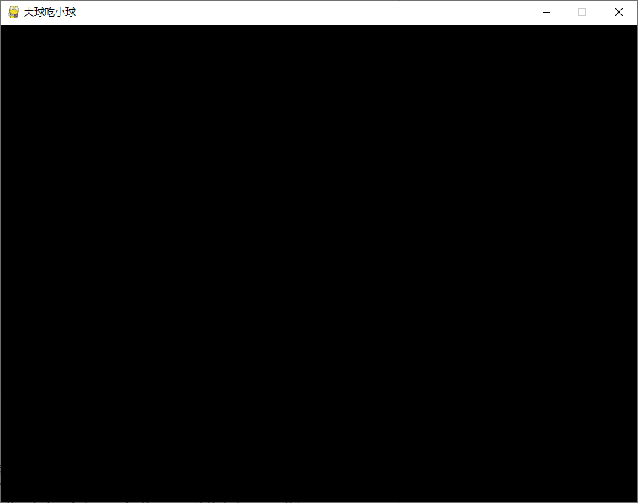
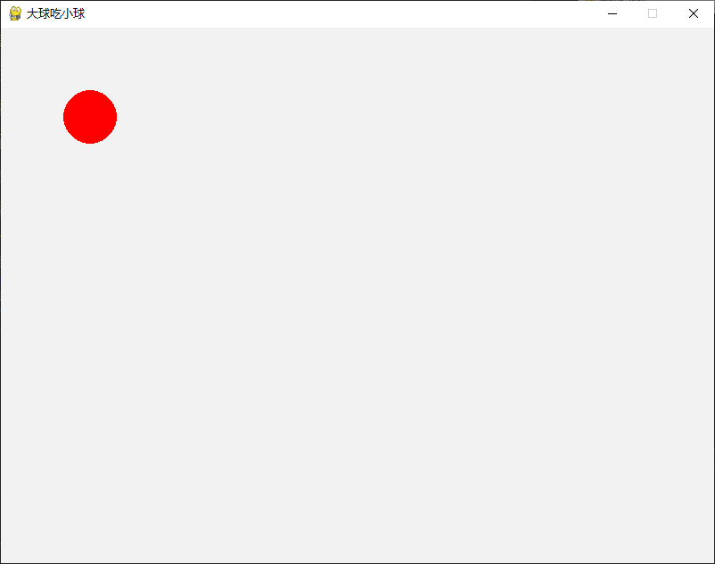

### 图形用户界面和游戏开发
***
#### 基于tkinter模块的GUI
GUI是图形用户界面的缩写。Python默认的GUI开发模块是tkinter，从这个名字就可以看出  
它是基于Tk的，Tk是一个工具包，最初是为Tcl设计的，后来被移植到很多其他的脚本语言中，  
它提供了跨平台的GUI控件。  
基本上使用Tkinter来开发GUI应用需要以下5个步骤：
* 导入Tkinter模块中需要的功能
* 创建一个顶层窗口对象并用它来承载整个GUI应用
* 在顶层窗口对象上添加GUI组件
* 通过代码将这些GUI组件的功能组织起来
* 进入主事件循环(main loop)  
```py
'''
File    :   GUI_example.py
Time    :   2023/03/01 20:44:41
Author  :   Z-JUNYE 
Version :   1.0
Comment :   Tkinter的GUI应用
'''

import tkinter
import tkinter.messagebox

def main():
    flag = True
    #修改标签上的文字
    def change_label_text():
        nonlocal flag
        flag = not flag
        color, msg = ('red', 'hello world!') if flag else ('blue', 'Goodbye world!')
        label.config(text = msg, fg = color)

    # 确认退出
    def confirm_to_quit():
        if tkinter.messagebox.askokcancel('提示', '确认退出吗？'):
            top.quit()

    #创建顶层窗口
    top = tkinter.Tk()
    #设置窗口大小
    top.geometry('240x160')
    #设置窗口标题
    top.title('小游戏')
    #创建标签对象并添加到顶层窗口
    label = tkinter.Label(top, text = 'Hello, World!', font = 'Arial -32', fg = 'red')
    label.pack(expand = 1)
    # 创建一个装按钮的容器
    panel = tkinter.Frame(top)
    #创建按钮对象，指定添加到哪个容器中 通过command参数绑定事件回调函数
    button1 = tkinter.Button(panel, text = '修改', command = change_label_text)
    button1.pack(side = 'left')
    button2 = tkinter.Button(panel, text = '退出', command = confirm_to_quit)
    button2.pack(side = 'right')
    panel.pack(side = 'bottom')
    #开启主事件循环
    tkinter.mainloop()

if __name__ == '__main__':
    main()
```
需要说明的是，GUI应用通常是事件驱动式的，之所以要进入主事件循环就是要监听鼠标、键盘  
等各种事件的发生并执行对应的代码对事件进行处理，因为事件会持续的发生，所以需要这样  
的一个循环一直运行着等待下一个事件的发生。另一方面，Tk为控件的摆放提供了三种布局管理器。
***
#### 使用Pygame进行游戏开发
pygame是一个开源的Python模块，专门用于多媒体应用的开发，其中包含对图像、声音、视频、事件、碰撞等的支持。Pygame建立在SDL的基础上，SDL是一套跨平台的多媒体开发库，用C语言实现，被广泛应用于游戏、模拟器、播放器等的开发。  
而Pygame让游戏开发者不再被底层语言束缚，可以更多的关注游戏的功能和逻辑。  
***
##### 制作游戏窗口
```py
import pygame

def main():
    '''初始化导入的pygame中的模块'''
    pygame.init()
    #初始化用于显示的窗口并设置窗口尺寸
    screen = pygame.display.set_mode((800,600))
    #设置当前窗口的标题
    pygame.display.set_caption('大球吃小球')
    running = True
    #开启一个事件循环处理发生的事件
    while running:
        #从消息队列中获取事件并对事件进行处理
        for event in pygame.event.get():
            if event.type == pygame.QUIT:
                running = False

if __name__ == '__main__':
    main()
```
画面如下：


***
##### 在窗口中绘图
可以通过pygame中draw模块的函数在窗口上绘图，可以绘制的图形包括：线条、矩形、多边形、圆、椭圆、圆弧等。需要说明的是，屏幕坐标系是将屏幕左上角设置为坐标原点(0,0)，向右是x轴的正向，向下是y轴的正向，在表示位置或者设置尺寸的时候，我们默认的单位都是像素。  
所谓像素就是屏幕上的一个点。  
Python中表示颜色用的色光三原色表示法，即通过一个元组或者列表来指定颜色的RGB值，每个值在0~255之间，因为是每种原色都用一个8 bit的值来表示，三种颜色相当于一共由24位构成，这就是“24位颜色表示法”。

```py
import pygame

def main():
    '''初始化导入的pygame中的模块'''
    pygame.init()
    #初始化用于显示的窗口并设置窗口尺寸
    screen = pygame.display.set_mode((800,600))
    #设置当前窗口的标题
    pygame.display.set_caption('大球吃小球')
    #设置窗口的背景色
    screen.fill((242,242,242))
    #绘制一个圆 参数：屏幕， 颜色，圆心位置，半径，0表示填充圆
    pygame.draw.circle(screen, (255,0,0),(100,100),30,0)
    #刷新当前窗口（渲染窗口将绘制的图像呈现出来）
    pygame.display.flip()
    running = True
    #开启一个事件循环处理发生的事件
    while running:
        #从消息队列中获取事件并对事件进行处理
        for event in pygame.event.get():
            if event.type == pygame.QUIT:
                running = False

if __name__ == '__main__':
    main()
```
画面如下:


***
##### 加载图像
如果需要直接加载图像到窗口上，可以使用pygame中image模块来加载函数，再通过之前获得的`blit`方法渲染图像。
